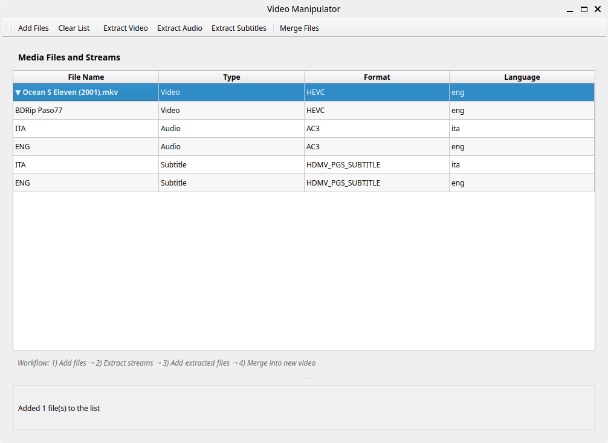

# Video Manipulator

A GUI application for video manipulation that provides a graphical interface to extract and merge video, audio, and subtitle streams using FFmpeg.

## Features

- **Stream Extraction**: Extract individual video, audio, and subtitle streams from media files
- **Stream Merging**: Combine multiple streams into a single output file
- **Multi-format Support**: Works with various video, audio, and subtitle formats
- **User-friendly Interface**: Intuitive GUI for easy stream selection and manipulation
- **FFmpeg Integration**: Leverages the power of FFmpeg for reliable media processing



## How to use

After launching the application (see Setup), you should first import one or more files to work on: video, audio and subtitles (in srt format).

Video files are examined for the contained streams.
You can see all contained streams by clicking on the arrow icon.

Once you have a video imported, you can do several things with it:
1. select one or more contained video streams and click "Extract video". This will extract each selected video stream into its own file.
2. select one or more contained audio streams and click "Extract audio". This will extract each selected audio stream into its own file.
3. select one or more contained subtitle streams and click "Extract subtitle". This will extract each selected subtitle stream into its own file.

With the "Merge" function you can create a new video file that contains your desired video, audio and subtitle streams.

Just import the files, select all the desired  streams from the table and click "Merge".

## Usage example

Suppose you have a video file, which contains English audio and English subtitles.
You want to have a new video file with Italian subtitles added.

You should:
1. Import the video file
2. Expand the video streams list by means of the arrow icon
3. Select the English subtitles stream
4. Click "Extract subtitle"
5. You will find a file (probably with ".srt" extension) in the same directory as the original video
6. You will translate the subtitles into Italian, using one of the many online services
7. Import the translated subtitles file
8. Select:
  a. The video stream from the original video file
  b. The English audio stream from the original video file
  c. The English subtitles stream from the original video file (optional)
  d. The Italian subtitles file
9. Click "Merge"

You will find a new video file, named after the original video file, with a "merged" suffix.
This file contains the orginal video, audio and subtitles, plus the new Italian subtitles.

## Setup Instructions

### 1. Create a Python Virtual Environment

Open a terminal in the project directory and run:

```sh
python3 -m venv .venv
```

### 2. Activate the Virtual Environment

On Linux/macOS:
```sh
source .venv/bin/activate
```

On Windows:
```sh
.venv\Scripts\activate
```

### 3. Install Dependencies

With the virtual environment activated, run:

```sh
pip install -r requirements.txt
```

### 4. Build the Standalone Executable

To build the application as a standalone executable, run:

```sh
make build
```

The executable will be created in the `dist` directory.

### 5. Run the Application

You can run the application directly:

```sh
make run
```

Or run the executable from the `dist` directory:

```sh
./dist/video-manipulator
```

---

**Note:**  
- Make sure you have FFmpeg installed and available in your system PATH.
- For any issues, check the `ffmpeg_error.log` file generated in the same directory
